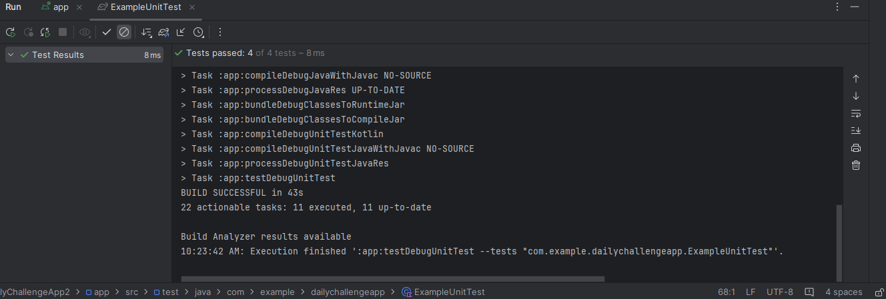
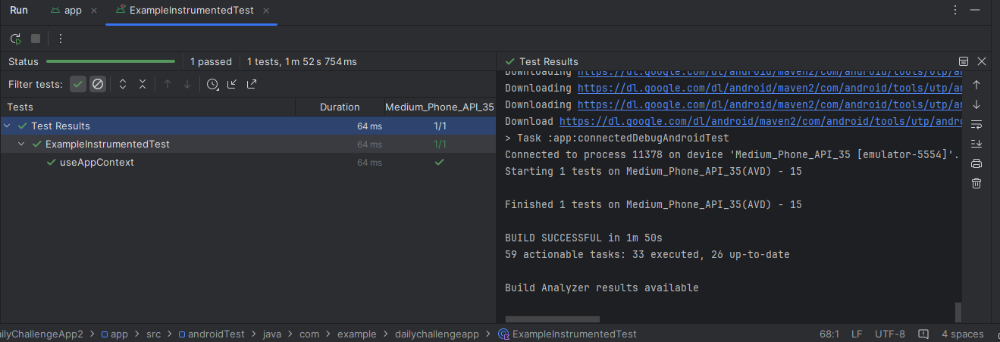

# 🎯 DaylichallangeApp

Aplikasi Android sederhana untuk mencatat dan menyelesaikan tantangan harian. Pengguna dapat menambahkan challenge, mengedit, menandai sebagai selesai, dan menghapusnya.

---
## ✍️ Author
Riska Haqika Situmorang | 2208107010086


## 🧪 Unit & Instrumented Testing

Aplikasi ini telah dilengkapi dengan **unit test (local test)** dan **instrumented test** untuk memastikan fungsionalitas dasar berjalan dengan baik.

---

### ✅ Unit Tests (Local Test)

File: `app/src/test/java/.../ExampleUnitTest.kt`

| Nama Test                        | Deskripsi                                                                 |
|----------------------------------|--------------------------------------------------------------------------|
| `addition_isCorrect()`           | Test sederhana untuk validasi operasi penjumlahan.                        |
| `addChallengeToRepository()`     | Memastikan data challenge berhasil ditambahkan ke repository.             |
| `editChallengeTitle()`           | Memastikan judul challenge bisa diedit dan tersimpan dengan benar.        |
| `clearChallenges_shouldEmptyList()` | Memastikan semua data challenge bisa dihapus dari repository.             |

---

### ✅ Instrumented Tests (Android Test)

File: `app/src/androidTest/java/.../ExampleInstrumentedTest.kt`

| Nama Test             | Deskripsi                                                       |
|------------------------|-----------------------------------------------------------------|
| `useAppContext()`      | Memastikan context aplikasi sesuai dengan package yang diharapkan. |
| `context_isNotNull()`  | Memastikan context tidak `null` saat aplikasi berjalan.        |

---

### 📸 Bukti Hasil Test

| Unit Test Results | Instrumented Test Results |
|-------------------|---------------------------|
|  |  |

---

## 🚀 Teknologi
- Kotlin
- Android SDK
- RecyclerView
- AlertDialog
- Unit Testing (JUnit)
- Instrumented Testing (AndroidJUnit4)

## 📂 Struktur Folder Utama

```bash
├── app/
│   ├── src/
│   │   ├── main/java/com/example/dailychallengeapp/
│   │   │   ├── MainActivity.kt
│   │   │   ├── Challenge.kt
│   │   │   ├── ChallengeAdapter.kt
│   │   │   └── ChallengeRepository.kt
│   │   ├── androidTest/java/.../ExampleInstrumentedTest.kt
│   │   └── test/java/.../ExampleUnitTest.kt


